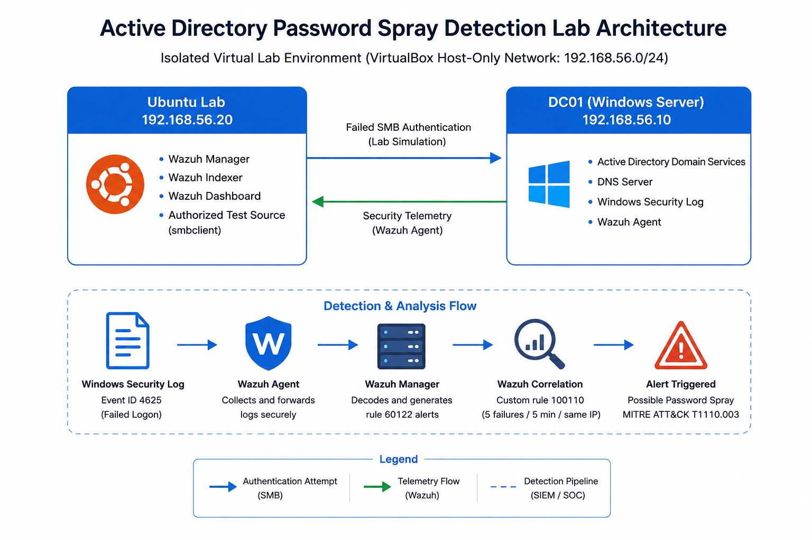

<div align="center">

# Fayaaz Khan — Cybersecurity Portfolio

### Entry-Level SOC Analyst | Blue Team | Security Monitoring

Houston, Texas · Open to local, hybrid, and remote opportunities

<p align="center">
  <a href="mailto:fayaazkhan1@gmail.com">
    
  </a>
  <a href="resume/Fayaaz_Yasin_Khan_SOC_Analyst_Resume.pdf">
    
  </a>
  <a href="projects/active-directory-wazuh-detection-lab/">
    
  </a>
  <a href="soc-labs/">
    
  </a>
</p>

</div>

---

## About This Portfolio

I am an entry-level cybersecurity professional transitioning from a software engineering background and building practical experience for a career in security operations.

This portfolio documents hands-on work involving:

- SIEM monitoring and alert investigation
- Windows Security event analysis
- Active Directory monitoring
- Detection engineering and validation
- Incident investigation and reporting
- MITRE ATT&CK mapping
- Security operations labs
- Bash and PowerShell fundamentals

I hold the **Google Cybersecurity Professional Certificate** and am currently preparing for **CompTIA Security+**.

---

## Portfolio Projects

| Project | Focus | Evidence |
|---|---|---|
| [Active Directory Password Spray Detection & Investigation Lab](projects/active-directory-wazuh-detection-lab/) | Active Directory, Windows Event ID 4625, Wazuh, detection engineering, and alert investigation | [Custom rule](projects/active-directory-wazuh-detection-lab/detections/password-spray-rule.xml) · [Investigation report](projects/active-directory-wazuh-detection-lab/reports/password-spray-investigation.md) |
| [SOC Labs and Investigations](soc-labs/) | Additional hands-on SOC exercises, investigation notes, and security-analysis practice | [Explore SOC labs](soc-labs/) |
| [Google Cybersecurity Certificate Work](google-cert/) | Security foundations, Linux, SQL, SIEM concepts, incident response, and Python | [View certificate work](google-cert/) |
| [Resume](resume/Fayaaz_Khan_SOC_Analyst_Resume.pdf) | SOC-focused résumé covering projects, technical skills, education, and professional experience | [View PDF](resume/Fayaaz_Khan_SOC_Analyst_Resume.pdf) |

---

# Featured Project

## Active Directory Password Spray Detection & Investigation Lab

I built an isolated Active Directory environment, collected Windows authentication telemetry with Wazuh, generated controlled authentication failures against fictional domain accounts, and developed a custom correlation rule for potential password-spray behavior.

<p align="center">
  
</p>

### Detection workflow

```text
Controlled authentication attempt
        ↓
Windows Security Event ID 4625
        ↓
Wazuh agent on DC01
        ↓
Wazuh base rule 60122
        ↓
Custom correlation rule 100110
        ↓
Possible password-spray alert
        ↓
SOC analyst investigation
```

### Key results

- Deployed a Windows Server domain controller for `bluecorp.local`
- Configured Active Directory Domain Services and DNS
- Created five fictional accounts for controlled testing
- Deployed Wazuh Manager, Indexer, and Dashboard on Ubuntu
- Enrolled the domain controller as an active Wazuh endpoint
- Collected and analyzed Windows Security Event ID `4625`
- Generated five controlled authentication failures from one source
- Created custom Wazuh correlation rule `100110`
- Configured a threshold of five failures within 300 seconds
- Mapped the activity to MITRE ATT&CK `T1110.003`
- Tested below-threshold and at-threshold behavior
- Investigated related successful logons and account lockouts
- Documented false positives, limitations, and response actions

<p align="center">
  <a href="projects/active-directory-wazuh-detection-lab/">
    
  </a>
  <a href="projects/active-directory-wazuh-detection-lab/reports/password-spray-investigation.md">
    
  </a>
</p>

---

## SOC Labs and Investigations

The [`soc-labs`](soc-labs/) directory contains additional hands-on exercises and documentation completed while developing my security-operations skills.

These smaller labs complement the featured Active Directory project by demonstrating continued practice with security analysis, investigation procedures, tools, and technical documentation.

<p>
  <a href="soc-labs/">
    
  </a>
</p>

---

## Technical Skills

### Security Operations

- SIEM monitoring
- Alert triage and validation
- Windows Security event analysis
- Authentication-event investigation
- Detection-rule development
- Threshold testing
- False-positive analysis
- Incident documentation
- MITRE ATT&CK mapping

### Systems and Identity

- Windows Server
- Active Directory Domain Services
- DNS
- Windows Event Viewer
- Ubuntu Linux
- VirtualBox networking
- Wazuh endpoint enrollment

### Tools and Scripting

- Wazuh
- PowerShell
- Bash
- Python fundamentals
- Git and GitHub
- Wireshark
- Nmap
- `smbclient`

---

## Tools Demonstrated

<p>
  
  
  
  
  
  
  
  
</p>

---

## Certification and Professional Development

### Google Cybersecurity Professional Certificate

Completed coursework and labs covering:

- Security foundations
- Network security
- Linux and SQL
- Threats and vulnerabilities
- Detection and incident response
- SIEM concepts
- Python security automation

[Verify credential](https://coursera.org/verify/professional-cert/J4S6X8PDBPZH)

### CompTIA Security+

Currently studying:

- Security operations
- Threats and vulnerabilities
- Identity and access management
- Security architecture
- Risk management
- Incident response

---

## What I Learned From the Featured Project

The Active Directory lab helped me connect individual security components into an end-to-end SOC workflow:

```text
Infrastructure
→ Identity activity
→ Endpoint telemetry
→ SIEM ingestion
→ Detection logic
→ Alert validation
→ Investigation
→ Documentation
```

I also gained practical troubleshooting experience with:

- VirtualBox NAT and host-only networking
- Competing Windows network routes
- Windows audit-policy configuration
- Wazuh deployment and service management
- Endpoint-agent enrollment
- Duplicate Wazuh rule IDs
- Detection thresholds
- Query and time-window validation

---

## Repository Structure

```text
cybersecurity-portfolio/
├── google-cert/
│   └── Google Cybersecurity Certificate work
├── projects/
│   └── active-directory-wazuh-detection-lab/
│       ├── architecture/
│       ├── detections/
│       ├── reports/
│       ├── screenshots/
│       └── scripts/
├── resume/
├── soc-labs/
│   └── Additional SOC exercises and write-ups
└── README.md
```

---

## Current Learning Focus

I am continuing to develop practical skills in:

- SOC alert triage
- Phishing-email analysis
- Indicator-of-compromise enrichment
- Vulnerability prioritization
- Incident-response playbooks
- Threat intelligence
- PowerShell and Python automation
- Cloud security fundamentals

New work will be added after it has been completed, tested, and documented.

---

## Roles of Interest

I am seeking entry-level opportunities including:

- SOC Analyst
- Junior Cybersecurity Analyst
- Security Operations Analyst
- Cybersecurity Support Analyst
- Junior Incident Response Analyst
- Information Security Analyst
- Security Operations Intern

**Location:** Houston, Texas  
**Work preference:** Local, hybrid, or remote  
**Email:** [fayaazkhan1@gmail.com](mailto:fayaazkhan1@gmail.com)

---

<div align="center">

### Building practical security experience through repeatable labs, tested detections, and documented investigations.

</div>
