# Active Directory Password Spray Detection Lab


## Overview

This beginner-friendly project documents my first complete SOC detection lab. I built an isolated Active Directory environment, collected Windows Security events with Wazuh, generated controlled failed authentication attempts against five fictional user accounts, and created a custom correlation rule to detect possible password-spray activity.

The project was performed only in a private lab using systems and accounts that I owned and controlled.

## What I Built

- A Windows Server domain controller named `DC01`
- A fictional Active Directory domain: `bluecorp.local`
- Five fictional standard-user accounts
- An Ubuntu server running Wazuh Manager, Indexer, and Dashboard
- A Wazuh agent on the domain controller
- A Bash script that generated controlled failed SMB authentications
- A custom Wazuh rule that correlated five failed logons within five minutes
- A SOC-style investigation and validation report

## Lab Architecture


| System | IP address | Role |
|---|---:|---|
| Ubuntu Lab | `192.168.56.20` | Wazuh server, dashboard, and authorized test source |
| DC01 | `192.168.56.10` | Windows Server, Active Directory, DNS, and Wazuh agent |
| Domain | `bluecorp.local` | Fictional Active Directory environment |

### Detection Flow

```text
Controlled failed authentication
        ↓
Windows Security Event ID 4625
        ↓
Wazuh agent on DC01
        ↓
Wazuh base rule 60122
        ↓
Custom correlation rule 100110
        ↓
SOC analyst investigation
```

## Business Problem

Password spraying tests one password, or a small set of passwords, against multiple accounts. This can help an attacker avoid the rapid account lockouts associated with repeatedly targeting one user.

A SOC analyst needs to determine:

- Which source generated the activity
- How many accounts were targeted
- Whether the attempts occurred within a short time window
- Whether any login succeeded afterward
- Whether any account was locked
- Whether privileged accounts were affected

## Technologies Used

- Windows Server
- Active Directory Domain Services
- DNS
- Ubuntu Linux
- Wazuh
- Oracle VirtualBox
- Windows Event Viewer
- Bash and PowerShell
- `smbclient`
- MITRE ATT&CK

## Active Directory Setup

I configured `DC01` as the domain controller for `bluecorp.local` and created five fictional standard-user accounts:

```text
ajohnson
bsmith
cgomez
dlee
edavis
```

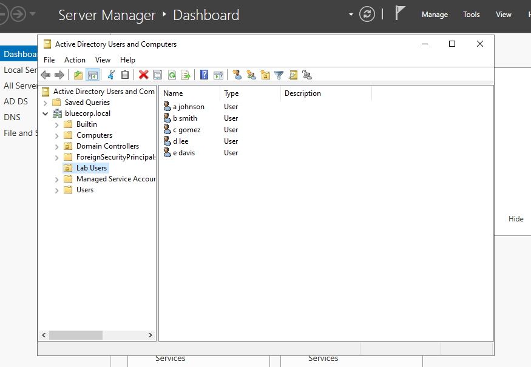

I confirmed that Windows auditing was configured to record authentication failures.

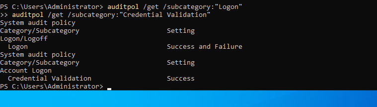

## Windows Security Evidence

A controlled failed authentication generated Windows Security Event ID `4625` on the domain controller.

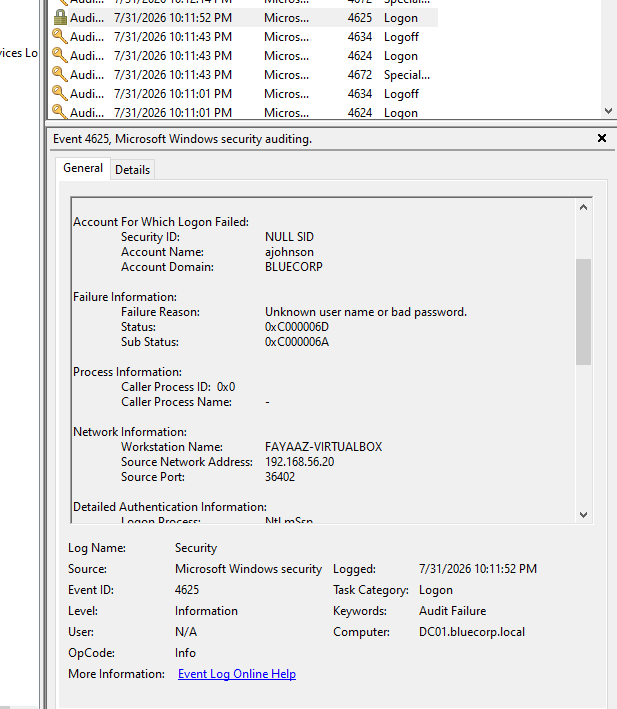

The same event was ingested by Wazuh through the agent installed on `DC01`.

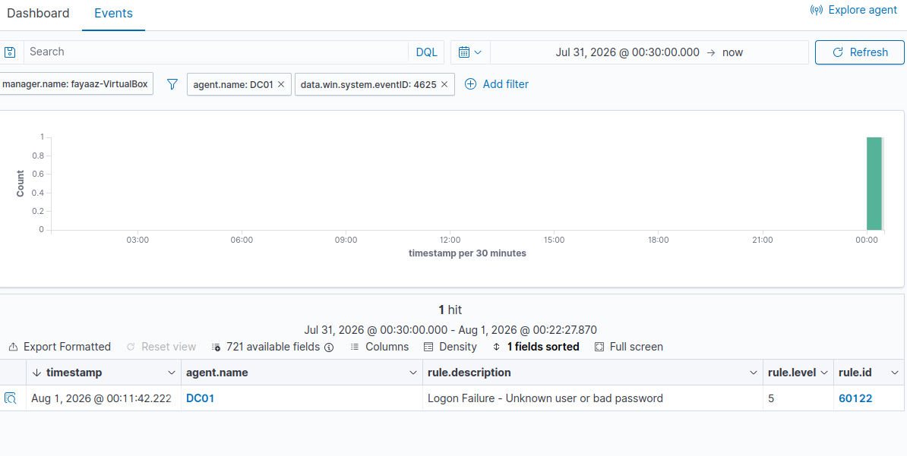

## Controlled Authentication Simulation

I created a Bash script that generated one expected failed authentication for each fictional account. The public version contains a password placeholder and is available in [`scripts/lab-auth-test.sh`](scripts/lab-auth-test.sh).

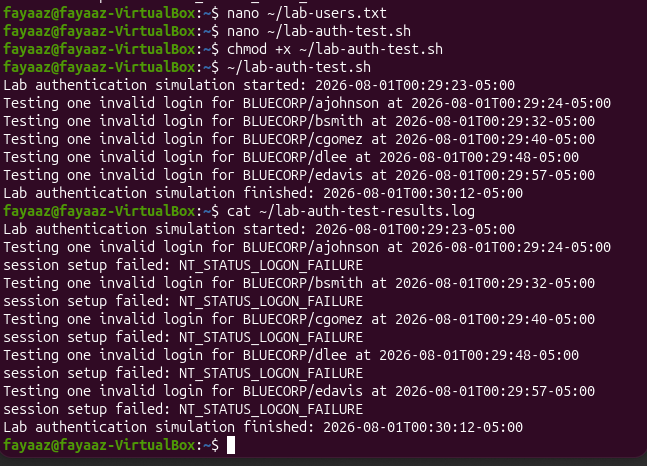

Wazuh recorded five individual failed-logon alerts using base rule `60122`.

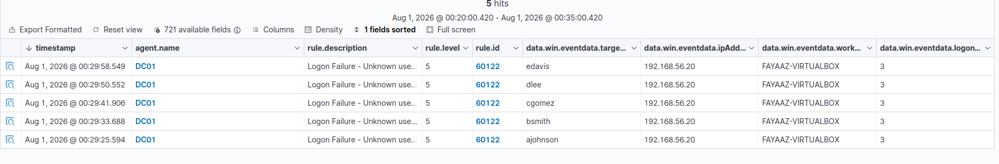

## Custom Detection Rule

I created Wazuh rule `100110` to correlate five base-rule `60122` events within a 300-second window from the same decoded source IP.

```xml
<rule id="100110" level="12" frequency="5" timeframe="300">
  <if_matched_sid>60122</if_matched_sid>
  <same_field>win.eventdata.ipAddress</same_field>
  <description>Possible Active Directory password spray: five failed logons from the same source within five minutes</description>
  <mitre>
    <id>T1110.003</id>
  </mitre>
</rule>
```

The complete rule is available in [`detections/password-spray-rule.xml`](detections/password-spray-rule.xml).

The detection is mapped to **MITRE ATT&CK T1110.003 — Password Spraying**.

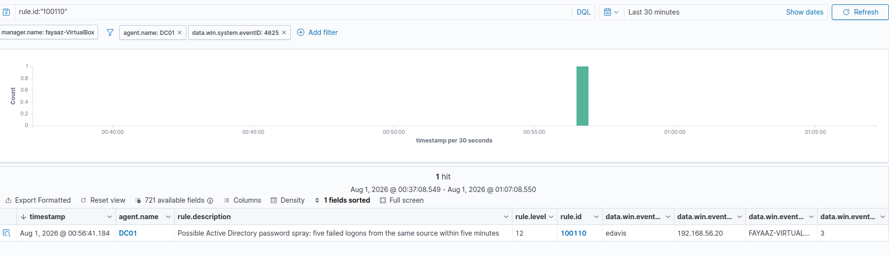

## Investigation

After the alert triggered, I reviewed:

- Source IP address
- Target system
- Target usernames
- Event timestamps
- Successful logons using Event ID `4624`
- Account lockouts using Event ID `4740`
- Whether privileged accounts were targeted

### Findings

- Five failed authentication attempts were observed.
- Five distinct fictional accounts were targeted.
- The source was the authorized Ubuntu lab system.
- No related successful authentication was identified afterward.
- No account lockouts were observed.
- No privileged accounts were targeted.

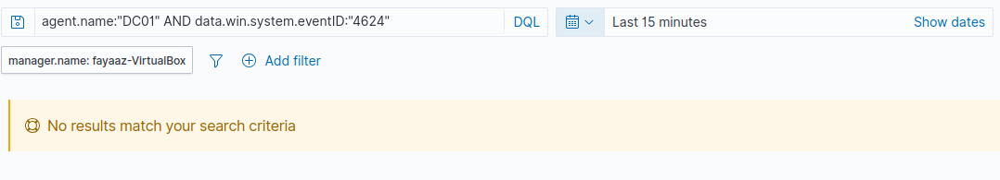

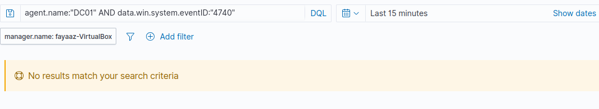

A full report is available in [`reports/password-spray-investigation.md`](reports/password-spray-investigation.md).

## Detection Validation

I tested the rule at two thresholds.

### Below Threshold: Three Users

Three failed authentications did not create a new custom alert.

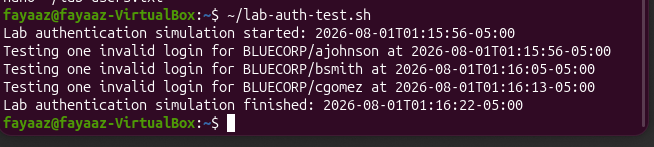

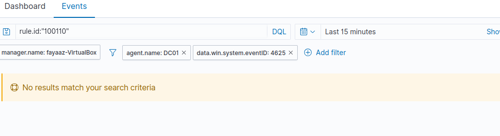

### At Threshold: Five Users

After restoring all five accounts, the custom alert triggered as expected.

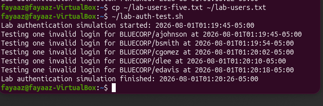

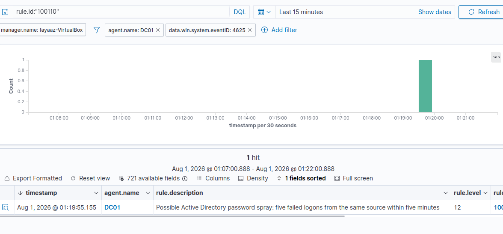

| Test | Expected result | Observed result |
|---|---|---|
| 3 failures | No custom alert | Passed |
| 5 failures within 5 minutes | Rule `100110` triggers | Passed |
| Event ID `4624` review | No related successful login | Passed |
| Event ID `4740` review | No account lockout | Passed |

## False Positives

Similar activity could be caused by:

- Expired or cached credentials
- Misconfigured applications or services
- Scheduled tasks using old passwords
- Vulnerability scanners
- Help-desk testing
- Shared workstations

An alert should therefore be investigated in context rather than treated as proof of compromise.

## Limitations

- The correlation rule does not independently prove every username is distinct.
- Slow password spraying may remain below the five-minute threshold.
- Distributed attacks may use several source IP addresses.
- Source-IP fields may be missing or altered.
- Production thresholds require baselining and tuning.

## Recommended Response

In a production environment, I would:

1. Confirm whether the source host is authorized.
2. Investigate or isolate an unknown source endpoint.
3. Review all targeted accounts.
4. Search for successful logons after the failures.
5. Determine whether privileged accounts were affected.
6. Reset credentials and revoke sessions if compromise is suspected.
7. Review similar activity across all domain controllers.
8. Preserve relevant logs and document the incident timeline.

## Skills Demonstrated

- Active Directory administration
- Windows Server configuration
- Windows Security event analysis
- Wazuh deployment and monitoring
- SIEM alert investigation
- Detection engineering
- XML rule development
- MITRE ATT&CK mapping
- Detection validation and tuning
- Bash and PowerShell
- Incident reporting
- Virtual lab networking

## Lessons Learned

This project helped me understand the complete detection workflow:

```text
User activity
→ Windows telemetry
→ SIEM ingestion
→ Detection logic
→ Alert validation
→ Analyst investigation
→ Incident documentation
```

It also taught me that a useful detection must be tested, documented, and reviewed for false positives and limitations.

## Repository Structure

```text
.
├── README.md
├── architecture/
│   └── lab-architecture.svg
├── detections/
│   └── password-spray-rule.xml
├── scripts/
│   ├── lab-auth-test.sh
│   └── lab-users.txt
├── reports/
│   └── password-spray-investigation.md
└── screenshots/
```

## Disclaimer

This project was conducted in an isolated private lab using systems and fictional accounts that I owned and controlled. The simulation was performed solely for defensive-security education and detection testing.
