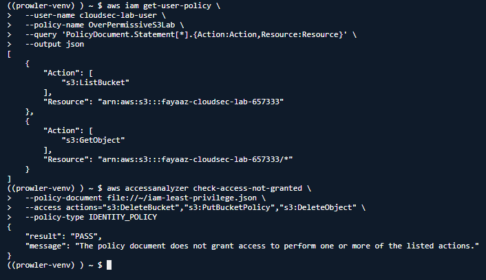
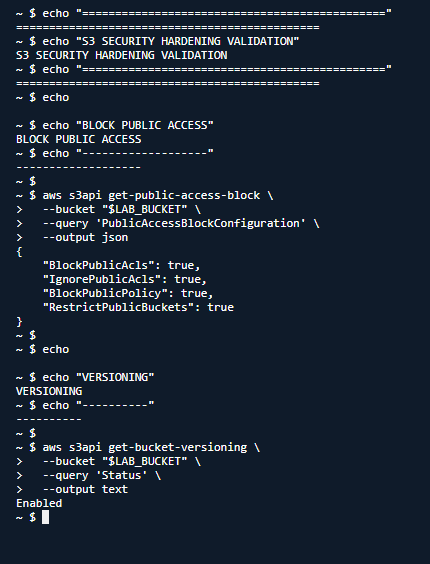
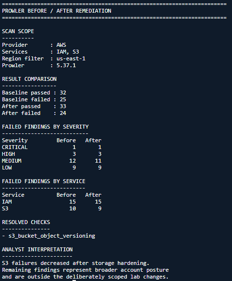

# AWS Cloud Security Misconfiguration Assessment & Remediation


## Overview

This project demonstrates a controlled AWS cloud-security assessment focused on **IAM least privilege**, **Amazon S3 public-access controls**, **resource-policy analysis**, and **before/after remediation validation**.

Rather than simply running a scanner, the lab deliberately introduced scoped security problems, tested them with AWS IAM Access Analyzer and Prowler, applied remediation, and validated the resulting state.

> The intentionally public S3 resource policy was evaluated as a policy document and **was never deployed to the live bucket**.

## Assessment Outcomes

| ID | Finding | Severity | Validation | Final State |
|---|---|---:|---|---|
| **CS-001** | IAM identity granted `s3:*` against `Resource: *` | High | Access Analyzer destructive-action test `FAIL → PASS` | Remediated |
| **CS-002** | Proposed S3 resource policy used `Principal: *` | High | Access Analyzer public-access test `FAIL → PASS` | Remediated in simulation |
| **CS-003** | S3 bucket versioning disabled | Medium | AWS CLI `Enabled`; Prowler check resolved | Remediated |

**[Read the full cloud-security assessment report](reports/cloud-security-assessment.md)**

---

## Why This Project Matters

Cloud security is often a configuration and identity problem rather than a traditional malware problem. Security teams need to determine:

- whether an identity has more privilege than required;
- whether a resource policy crosses the intended trust boundary;
- whether storage controls reduce public-exposure and recovery risk;
- whether a remediation actually removed the identified access or configuration problem.

This project follows that workflow from finding through validation.

## Investigation Workflow

```text
Dedicated AWS lab
      ↓
Create controlled IAM misconfiguration
      ↓
Validate excessive access with Access Analyzer
      ↓
Evaluate proposed public S3 policy before deployment
      ↓
Run Prowler IAM/S3 baseline
      ↓
Apply least-privilege IAM remediation
      ↓
Enable S3 Block Public Access + versioning
      ↓
Validate restricted S3 policy
      ↓
Re-run Prowler
      ↓
Document risk reduction and limitations
```

---

## Finding CS-001 — IAM Least Privilege

### Initial state

The lab IAM user was intentionally assigned:

```json
{
  "Effect": "Allow",
  "Action": "s3:*",
  "Resource": "*"
}
```

The intended requirement was only to list one bucket and read its objects.

IAM Access Analyzer confirmed that the broad policy granted actions outside that requirement, including the tested destructive/security-sensitive operations:

```text
s3:DeleteBucket
s3:PutBucketPolicy
s3:DeleteObject
```

### Remediation

Permissions were reduced to:

```text
s3:ListBucket → one lab bucket
s3:GetObject  → objects in that bucket
```

The same Access Analyzer test then returned `PASS`.



**Policy examples:** [over-permissioned](policies/iam-overpermissive.json) · [least privilege](policies/iam-least-privilege.json)

---

## Finding CS-002 — S3 Public-Access Policy Analysis

A proposed S3 policy used:

```json
"Principal": "*"
```

with `s3:GetObject`. IAM Access Analyzer returned `FAIL`, identifying the policy as granting public access for the evaluated resource type.

The unsafe policy was **not deployed**. It was replaced with a policy restricted to one explicit IAM identity, and the public-access evaluation changed to `PASS`.

S3 Block Public Access was also explicitly configured with all four controls enabled:

```text
BlockPublicAcls       : true
IgnorePublicAcls      : true
BlockPublicPolicy     : true
RestrictPublicBuckets : true
```



**Policy examples:** [public-access simulation](policies/s3-public-policy-simulation.json) · [restricted policy](policies/s3-private-policy.json)

---

## Finding CS-003 — S3 Versioning

The lab bucket initially had versioning disabled. Versioning was enabled to improve recovery options for object overwrite or deletion.

The post-remediation Prowler comparison showed:

```text
Baseline: 32 PASS / 25 FAIL
After:    33 PASS / 24 FAIL

IAM failures: 15 → 15
S3 failures : 10 → 9
```

and identified the following resolved failed check:

```text
s3_bucket_object_versioning
```



The unchanged aggregate IAM count is intentionally documented. CS-001 was validated by the targeted IAM Access Analyzer test rather than by claiming that Prowler's overall IAM posture improved.

---

## Tools Used

- **AWS IAM** — controlled identity and permission configuration
- **Amazon S3** — storage security and resilience controls
- **AWS CLI** — configuration, inspection, and remediation
- **IAM Access Analyzer** — targeted policy validation and public-access analysis
- **Prowler 5.37.1** — broader IAM/S3 cloud-security posture assessment
- **Python** — sanitized parsing of Prowler CSV results
- **Git/GitHub** — evidence-backed portfolio documentation

---

## Prowler Analysis

Raw Prowler reports contain account- and resource-specific metadata, so they are intentionally excluded from the public repository.

[`scripts/summarize_prowler.py`](scripts/summarize_prowler.py) parses the semicolon-delimited Prowler CSV and outputs only public-safe fields such as:

- pass/fail counts;
- severity counts;
- service counts;
- resolved check IDs.

The structured assessment outcome is also available in [`outputs/cloud-security-assessment-summary.json`](outputs/cloud-security-assessment-summary.json).

---

## Evidence

The complete public-safe evidence trail is indexed in [`screenshots/README.md`](screenshots/README.md).

Key evidence includes:

- IAM excessive-permission detection and least-privilege validation
- public S3 policy simulation and restricted-policy validation
- S3 Block Public Access configuration
- S3 versioning validation
- sanitized Prowler baseline and post-remediation comparison

---

## Repository Structure

```text
aws-cloud-security-assessment/
├── outputs/
│   └── cloud-security-assessment-summary.json
├── policies/
│   ├── iam-least-privilege.json
│   ├── iam-overpermissive.json
│   ├── s3-private-policy.json
│   └── s3-public-policy-simulation.json
├── reports/
│   └── cloud-security-assessment.md
├── screenshots/
│   └── README.md
├── scripts/
│   └── summarize_prowler.py
├── .gitignore
└── README.md
```

---

## Security and Evidence Limitations

- The proposed public S3 policy was evaluated but never attached to the live bucket.
- Prowler assessed broader IAM and S3 account posture beyond the three deliberately scoped findings.
- The IAM finding was validated through Access Analyzer; the aggregate Prowler IAM failure count did not change.
- Raw Prowler reports are withheld because they contain AWS account IDs, resource identifiers, ARNs, and other environment metadata.
- Published IAM ARN examples redact the AWS account ID.
- The lab contained no production workload or sensitive business data.

---

## Skills Demonstrated

- AWS cloud-security assessment
- IAM least-privilege analysis
- IAM policy remediation
- Amazon S3 security
- S3 Block Public Access
- S3 versioning
- IAM Access Analyzer
- Prowler
- AWS CLI
- Cloud misconfiguration analysis
- Remediation validation
- Security risk prioritization
- Python CSV parsing
- Evidence sanitization
- Cloud-security reporting

## Current Status

**Technical assessment and remediation are complete.** Public screenshots are being added to the evidence folder, followed by final AWS lab cleanup.

## Disclaimer

This project was performed in a dedicated personal AWS lab for defensive security education and portfolio demonstration. No production systems or third-party AWS resources were targeted.
