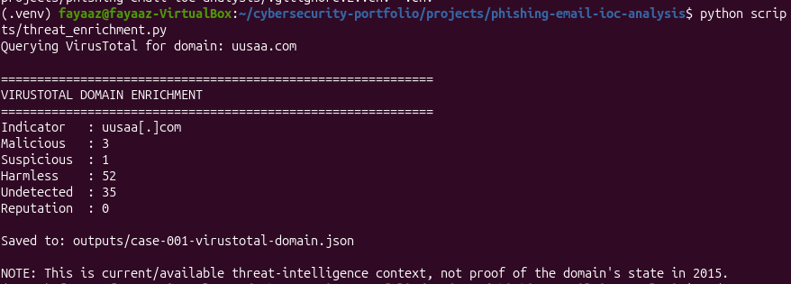
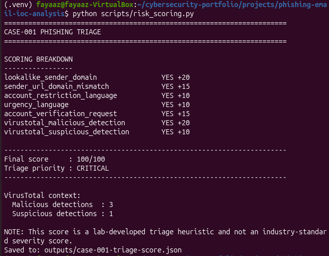
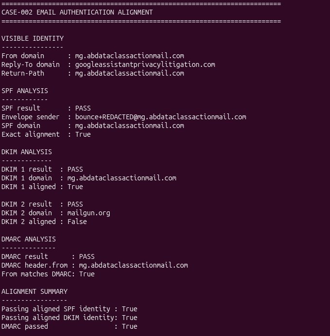
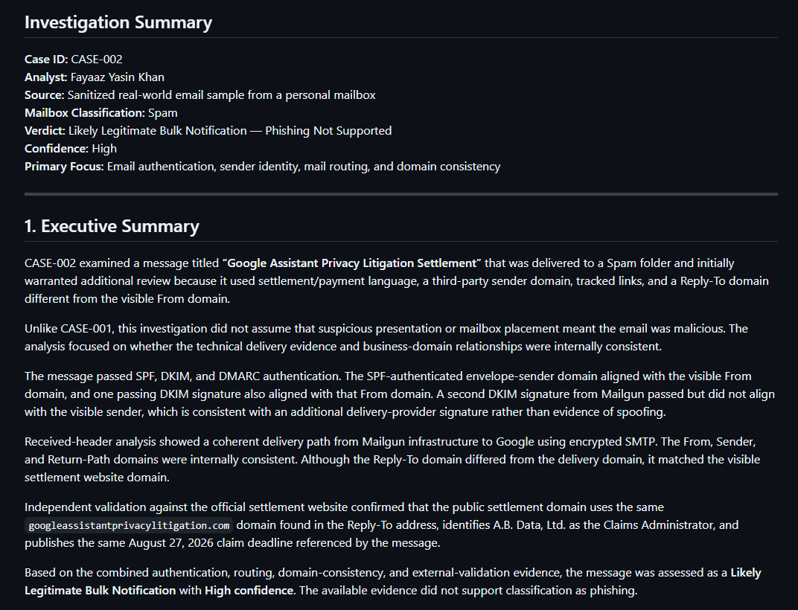

# Phishing Email Investigation & IOC Enrichment


## Overview

This project demonstrates evidence-driven email investigation through **two contrasting SOC cases**.

- **Case 001:** a malicious phishing sample was escalated after IOC analysis, threat-intelligence enrichment, explainable triage, and analyst review.
- **Case 002:** a suspicious-looking message delivered to Spam was cleared as likely legitimate after full-header analysis, SPF/DKIM/DMARC validation, mail-route reconstruction, domain comparison, and independent context validation.

The goal is to show analyst judgment rather than simply label every suspicious message as malicious.

## Investigation Outcomes

| Case | Investigation Focus | Final Outcome | Confidence |
|---|---|---|---|
| **001** | Phishing content, sender/URL analysis, IOC enrichment, automated triage | **Malicious — Phishing** | High |
| **002** | Full headers, SPF/DKIM/DMARC, routing, sender identity, domain validation | **Likely Legitimate Bulk Notification — Phishing Not Supported** | High |

**Reports:** [Case 001](reports/case-001-investigation.md) · [Case 002](reports/case-002-investigation.md) · [Report index](reports/README.md)

---

## Case 001 — Malicious Phishing

### What was investigated

A phishing research sample presented itself as USAA communication and requested account verification.

### Key findings

- Sender domain: `uusaa[.]com`
- Displayed URL host: `usaa[.]com`
- Lookalike / typosquatted sender-domain characteristic
- Account-restriction and urgency language
- Account-verification request
- VirusTotal context at time of analysis: **3 malicious**, **1 suspicious** detections
- Lab-developed triage score: **100/100**
- Final verdict: **Malicious — Phishing**
- Confidence: **High**
- MITRE ATT&CK: `T1566 — Phishing`

> The triage score is a portfolio-lab prioritization heuristic, not an industry-standard severity score. The final verdict remained an analyst decision.

### Case 001 workflow

```text
Research dataset
      ↓
Integrity + structure validation
      ↓
Case selection and sanitization
      ↓
IOC extraction and URL parsing
      ↓
Sender / destination comparison
      ↓
VirusTotal enrichment
      ↓
Explainable triage scoring
      ↓
Analyst review
      ↓
Malicious phishing verdict
```

### Selected evidence

#### Threat-intelligence enrichment



#### Explainable triage



**[Read the full Case 001 report](reports/case-001-investigation.md)** · **[Browse Case 001 evidence](screenshots/)**

---

## Case 002 — Full Email Header Investigation

### What was investigated

A real-world settlement notification landed in a Spam folder and initially warranted review because it used settlement/payment language, third-party sending infrastructure, tracked links, and a Reply-To domain different from the visible From domain.

Instead of treating the Spam label as a verdict, the case examined the full technical delivery evidence.

### Key findings

- SPF: **PASS + aligned**
- DKIM: **PASS**, including an aligned organizational signature
- Additional Mailgun DKIM signature: **PASS**, not aligned to visible From
- DMARC: **PASS**
- From domain matched Return-Path and Sender domains
- Reply-To domain matched the visible settlement website domain
- Received-chain reconstruction showed **Mailgun → Google** delivery
- Observed sending IP: `204.220.171.193`
- Google-facing delivery used TLS-protected SMTP
- Independent validation supported the claims-administrator / settlement-domain relationship
- Final verdict: **Likely Legitimate Bulk Notification — Phishing Not Supported**
- Confidence: **High**

### Case 002 workflow

```text
Suspicious-looking Spam message
      ↓
Sanitized full-header artifact
      ↓
From / Reply-To / Return-Path analysis
      ↓
SPF / DKIM / DMARC alignment
      ↓
Received-chain reconstruction
      ↓
Domain-consistency analysis
      ↓
Independent context validation
      ↓
Analyst review
      ↓
Likely legitimate bulk notification
```

### Selected evidence

#### Authentication alignment



#### Final investigation outcome



**[Read the full Case 002 report](reports/case-002-investigation.md)** · **[View structured assessment](outputs/case-002-final-assessment.json)** · **[Review external validation notes](docs/case-002-external-validation.md)**

---

## Why the Two Cases Matter Together

The value of the project is the contrast between outcomes.

```text
CASE 001 — TRUE POSITIVE
Suspicious indicators
      ↓
IOC + threat-intelligence evidence
      ↓
Escalate as malicious phishing

CASE 002 — FALSE-POSITIVE REDUCTION
Suspicious presentation / Spam placement
      ↓
Authentication + routing + identity validation
      ↓
Clear as likely legitimate
```

A SOC analyst should be able to **escalate real threats and reduce false positives**. These cases demonstrate both decisions using documented evidence.

---

## Automation Developed

### Case 001

| Script | Purpose |
|---|---|
| [`inspect_dataset.py`](scripts/inspect_dataset.py) | Validate dataset structure and record counts |
| [`diagnose_dataset.py`](scripts/diagnose_dataset.py) | Troubleshoot dataset and case-selection assumptions |
| [`select_case.py`](scripts/select_case.py) | Identify useful phishing samples |
| [`create_case.py`](scripts/create_case.py) | Produce a sanitized structured case |
| [`review_case.py`](scripts/review_case.py) | Present sanitized evidence for analyst review |
| [`analyze_links.py`](scripts/analyze_links.py) | Inspect URL occurrences and HTML-link structure |
| [`analyze_iocs.py`](scripts/analyze_iocs.py) | Parse IOCs and compare sender / URL domains |
| [`threat_enrichment.py`](scripts/threat_enrichment.py) | Enrich the sender domain with VirusTotal API v3 |
| [`risk_scoring.py`](scripts/risk_scoring.py) | Calculate an explainable triage score |
| [`finalize_case.py`](scripts/finalize_case.py) | Record the analyst verdict in structured JSON |

### Case 002

| Script | Purpose |
|---|---|
| [`parse_email_headers.py`](scripts/parse_email_headers.py) | Parse identity, authentication, and Received headers |
| [`analyze_authentication.py`](scripts/analyze_authentication.py) | Explain SPF, DKIM, and DMARC alignment |
| [`analyze_mail_route.py`](scripts/analyze_mail_route.py) | Reconstruct the delivery path chronologically |
| [`analyze_content_domains.py`](scripts/analyze_content_domains.py) | Compare From, Reply-To, Return-Path, Sender, and visible content domains |
| [`finalize_case_002.py`](scripts/finalize_case_002.py) | Produce the structured final analyst assessment |

---

## Repository Structure

```text
phishing-email-ioc-analysis/
├── data/
│   └── sanitized/
│       ├── case-001.json
│       └── case-002-header-sample.eml
├── docs/
│   ├── scoring-methodology.md
│   └── case-002-external-validation.md
├── outputs/
│   ├── case-001-triage-score.json
│   ├── case-001-virustotal-domain.json
│   └── case-002-final-assessment.json
├── reports/
│   ├── README.md
│   ├── case-001-investigation.md
│   ├── case-001-notes.md
│   └── case-002-investigation.md
├── screenshots/
│   ├── 01–08  Case 001 evidence
│   └── 09–13  Case 002 evidence
├── scripts/
├── .gitignore
├── requirements.txt
└── README.md
```

Raw source data, personalized email identifiers, API secrets, and the Python virtual environment are intentionally excluded from public Git history.

---

## Evidence Limitations

### Case 001

The source was a research CSV rather than the complete original `.eml`, so full routing headers, SPF, DKIM, DMARC, and original MIME structure were unavailable.

### Case 002

The public artifact is intentionally sanitized. Personalized identifiers, tracking tokens, and message-specific values that were unnecessary for defensive header analysis were removed.

Passing email authentication is **supporting evidence**, not proof that message content or a business request is trustworthy. That is why Case 002 combines authentication with routing, identity relationships, and independent context validation.

---

## Skills Demonstrated

- Phishing and suspicious-email analysis
- IOC extraction, defanging, parsing, and enrichment
- Threat-intelligence interpretation
- SPF, DKIM, and DMARC analysis
- Email-authentication alignment
- Full-header parsing
- `Received:` chain reconstruction
- Sender / Reply-To / Return-Path analysis
- Domain-consistency analysis
- False-positive reduction
- Python security automation
- Regular expressions and JSON processing
- VirusTotal API integration
- MITRE ATT&CK mapping
- SOC-style investigation reporting
- Evidence sanitization and limitation analysis

---

## Evidence & Reports

- **[Complete screenshot evidence index](screenshots/readme.md)**
- **[Investigation report index](reports/README.md)**
- **[Case 001 final report](reports/case-001-investigation.md)**
- **[Case 002 final report](reports/case-002-investigation.md)**
- **[Case 002 structured analyst assessment](outputs/case-002-final-assessment.json)**

## Safe-Handling Notes

- Public indicators are defanged where appropriate.
- VirusTotal credentials are loaded locally and are not committed.
- Raw research data is excluded from Git.
- The real-world Case 002 artifact was sanitized before publication.
- Threat-intelligence, mailbox labels, and authentication results are treated as evidence inputs rather than automatic verdicts.

## Disclaimer

This project is for defensive security education and portfolio demonstration. Analysis was performed on public research data and sanitized artifacts. No live phishing infrastructure was intentionally accessed through the analysis scripts.
